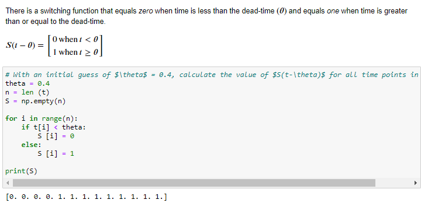

## Task 4: Nonlinear Regression Curve Fit

This assignment is about fitting models to data and analyzing data to determine statistical quantities. Data analysis is a major part of an engineer's ability to extract useful and actionable information from data.

* Nonlinear regression

* Statistical and other 

* Create bar plot

### # 4-1 Linear systems of equations

* R_square for Curve_fitting evaluation 

### # 4-2 Conditional Curve fit with step fuction

* Step fuction definition (S)

* Fit the data and optimize the parameter

### # 4-3 Curve_fit with random number

### Tutorial source
https://apmonitor.com/che263/index.php/Main/HomePage
