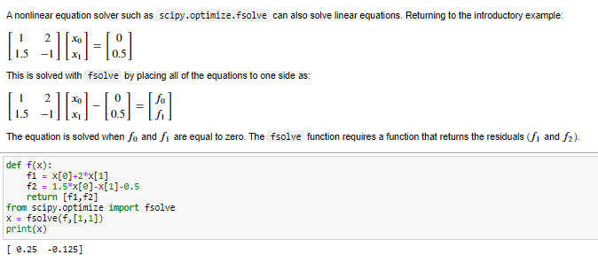
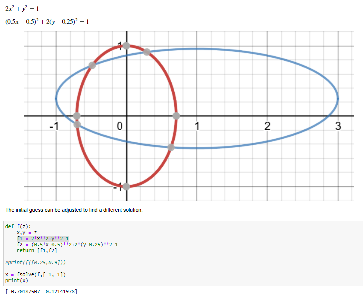
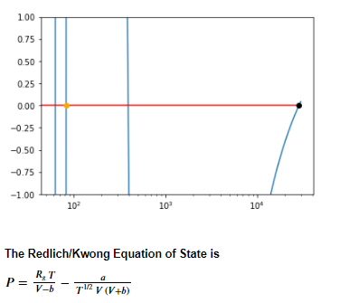

## Task 3: Equation Solving

Systems of equations are solved by finding variable values that satisfy all of the equations. With linear systems of equations, there is typically a unique solution that is easy to solve, even for large-scale systems. Nonlinear equations can be more challenging to solve and may have multiple solutions. Variable bounds and a good initial guess are sometimes required for nonlinear systems of equations. This section is to solve systems of: 

* Linear systems of equations

* Nonlinear systems of equations

* Solving the Redlich/Kwong Equation of State

* Tutorial source
https://apmonitor.com/che263/index.php/Main/HomePage
